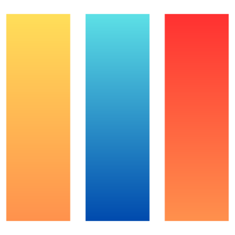

# SDF — Smart Document Format

> Source-available smart document format — spec, core kit, CLI, and demos

**License:** Business Source License 1.1 (BUSL-1.1) — Copyright (c) 2026 Yunus YILDIZ
**Change Date:** 2031-03-17 → Apache License 2.0

---

## Author

<h3>Yunus YILDIZ</h3>

Creator of  SDF &nbsp;·&nbsp; Full Stack Developer

 <a href="https://etapsky.com">etapsky.com</a>

<em>Always learning. Always building.</em>

Transforming ideas into digital experiences. Passionate about solving real-world challenges through technology.

Built with ☕ and ❤️ · Geneva, Switzerland · March 2026

